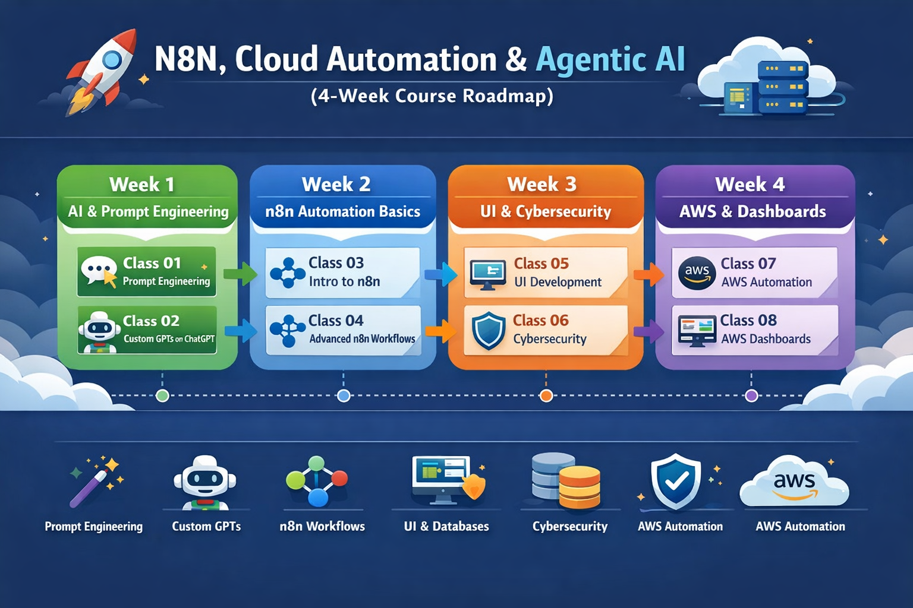

# 🚀 N8N, Cloud Automation & Agentic AI  
### 4-Week Professional Training Program

Welcome to the **N8N and Cloud Automation – United States Classes** repository.

This public repository contains **complete learning materials** for a **4-week online professional training program** focused on **Agentic AI**, **Low-Code Automation**, **Custom GPTs**, **n8n workflows**, **Lovable UI development**, **Cybersecurity fundamentals**, and **AWS Cloud Automation**.

All **workflows, slides, prompts, and hands-on implementations** used during the live classes are available in this repository and can be freely accessed by anyone for **learning and practice**.

---

## 🏢 Program Organization

This training program was **organized and hosted by**:

**Bluecoat Technology**  
🌐 https://bluecoattechnology.com/

The program was conducted as part of Bluecoat Technology’s initiative to train professionals in **AI, automation, and cloud technologies**.

---

## 👨‍🏫 Instructor & Consultant

**Muhammad Hamza**  
AI Engineer | Full-Stack Developer | AI Educator  

Muhammad Hamza served as an **Instructor and Technical Consultant** for this program and was responsible for:

- Designing the **complete 4-week curriculum**
- Delivering **live online classes**
- Teaching **Prompt Engineering & Custom GPTs**
- Building **Agentic AI workflows**
- Implementing **n8n automations**
- Developing **Lovable UI & dashboards**
- Explaining **Cybersecurity fundamentals**
- Automating **AWS cloud services**
- Preparing **slides, workflows, and learning resources**

---

## 🎯 Learning Roadmap

## 📅 Course Structure  
**Duration:** 4 Weeks  
**Classes:** 2 Classes per Week (8 Total)

---

### 🟢 Week 1 – AI & Prompt Engineering Foundations

#### **Class 01: Prompt Engineering**
- Prompt engineering fundamentals
- System, user & assistant prompts
- Zero-shot & few-shot prompting
- Prompt patterns for automation
- Real-world AI use cases

#### **Class 02: Custom GPTs (ChatGPT)**
- Creating custom GPTs
- Instruction design & role definition
- Knowledge-based GPTs
- Tool-enabled GPTs
- Practical hands-on GPT creation

---

### 🟢 Week 2 – n8n Automation

#### **Class 03: Introduction to n8n**
- What is n8n & low-code automation
- Triggers, nodes & execution flow
- Webhooks & REST APIs
- Building the first automation workflow

#### **Class 04: Deep Dive into n8n**
- Advanced workflow logic
- Conditions, loops & branching
- Error handling & retries
- AI-powered automation workflows
- Multiple real-world hands-on examples

---

### 🟢 Week 3 – UI Development & Cybersecurity

#### **Class 05: UI Development with Lovable**
- UI development using Lovable
- Building a **personal portfolio website**
- Connecting frontend with databases
- Data-driven UI components
- Practical implementation

#### **Class 06: Cybersecurity Fundamentals**
- Cybersecurity basics
- Threats, vulnerabilities & attacks
- Secure APIs & authentication
- Cloud & automation security
- AI & cybersecurity considerations

---

### 🟢 Week 4 – AWS Automation & Dashboards

#### **Class 07: AWS Cloud Automation with n8n**
- Automating AWS services using n8n
- Monitoring & alerting workflows
- Cost & resource automation
- AI-driven cloud workflows

#### **Class 08: AWS Dashboard with Lovable**
- Building dashboards using Lovable
- Visualizing AWS data
- Connecting AWS APIs
- Real-time monitoring dashboards
- End-to-end cloud automation project

---

## 📌 What This Repository Contains

- ✅ **n8n Workflows** (basic → advanced)
- ✅ **Presentation Slides** for all sessions
- ✅ **Prompt Engineering Examples**
- ✅ **Custom GPT Instructions**
- ✅ **Lovable UI Projects**
- ✅ **Cybersecurity Notes**
- ✅ **AWS Automation Use Cases**
- ✅ **Dashboard Implementations**

All content is **publicly accessible** and intended for educational use.

---

## 🛠 Tools & Technologies Covered

- Prompt Engineering
- Custom GPTs (ChatGPT)
- n8n (Low-Code Automation)
- Lovable (UI & Dashboards)
- Databases
- Cybersecurity Concepts
- AWS Cloud Services
- REST APIs & Webhooks

---

